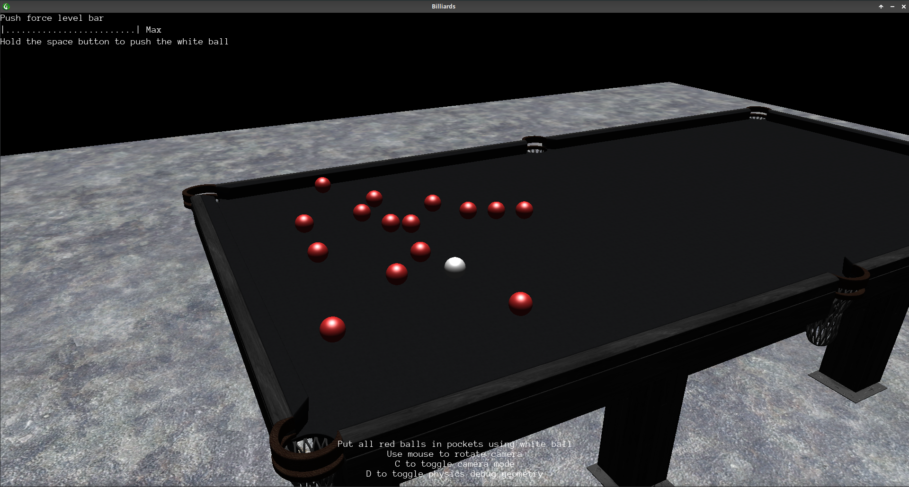

# billiards

Simple billiards game in the [Urho3D](https://urho3d.github.io/) engine.

Created based on Urho3D examples. Disclaimer: This is my first test project in Urho3D and C++.

See in game preview:




## Running

The game uses Urho3D 1.7 as an external resource.

### Linux

1. Build the Urho3D engine

1. Export environment variable URHO3D_HOME pointing to engine location

1. Go to the game directory

1. Generate make files

    ```bash
    cmake .
    ```

1. Build the game

    ```bash
    make
    ```

1. Run it!

    ```bash
    ./bin/billiards
    ```

## Used resources

[Table model](https://3dsky.org/3dmodels/show/bil_iardnyi_stol_samurai_2)
